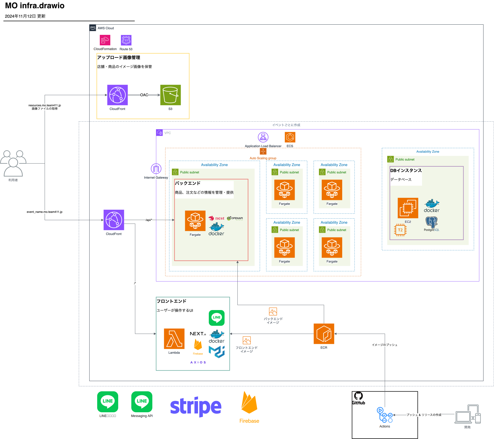
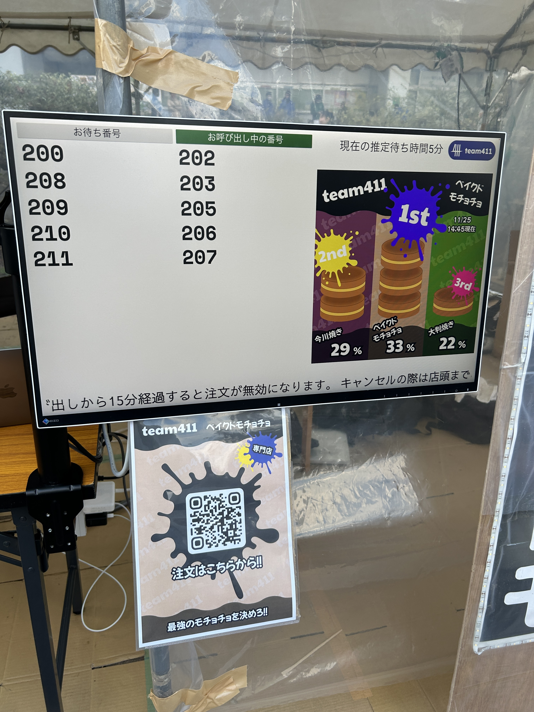
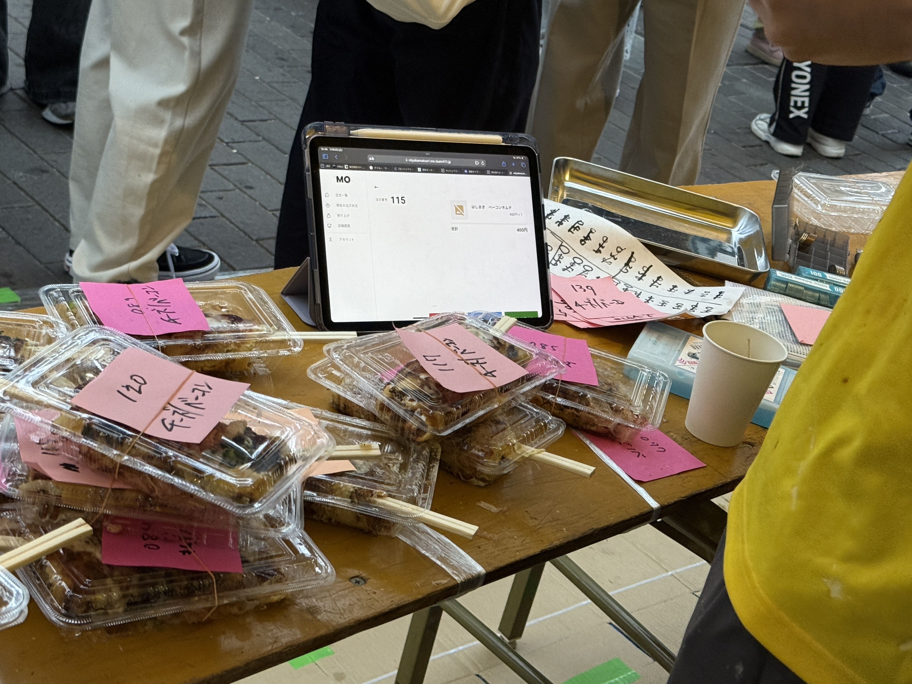

模擬店の注文管理や待機列の課題を解決するモバイルオーダーシステム。低コストで導入でき、混雑緩和や待ち時間短縮を実現し、来場者の満足度向上と売上向上をサポートします。

## 使用技術

バックエンド

- NestJS
- Prisma
- PostgreSQL
- Firebase Admin
- LINE Bot SDK
- AWS SDK

フロントエンド

- Next.js
- Firebase
- LIFF
- Tailwind
- Stripe

インフラ

- AWS CDK
- AWS (ECS, Lambda, ECR, CloudFront, S3, Route53, Certificate Manager, IAM)

開発ツール

- Docker
- GitHub Actions
- Jest
- Draw.io
- Figma
- Notion

インフラ構成図（一部）

## これまでの歩み

### U☆PoC〜UECアイディア実証コンテスト〜 2023協賛企業賞受賞

既存の社会問題解決や、未来の豊かな⽣活のための新たな技術・サービスに関する学⽣のアイディアを競い、育むコンテストである『[U☆PoC](https://www.uec.ac.jp/research/venture/contest.html)』（ユーポック） にteam411より「⽂化祭向け汎⽤モバイルオーダーシステム」として出場し、株式会社ハートビーツより協賛企業賞を受賞しました。

https://www.uec.ac.jp/research/venture/2023/final.html#:~:text=%E6%A8%A1%E6%93%AC%E5%BA%97%E3%81%AB%E3%81%8A%E3%81%91%E3%82%8B%E6%B1%8E%E7%94%A8%E7%9A%84%E3%81%AA%E3%83%A2%E3%83%90%E3%82%A4%E3%83%AB%E3%82%AA%E3%83%BC%E3%83%80%E3%83%BC%E3%82%B7%E3%82%B9%E3%83%86%E3%83%A0%E3%81%AE%E6%8F%90%E6%A1%88

### 第73回調布祭での導⼊

昨年11月に行われた電気通信大学の学園祭である第73回調布祭では、team411の模擬店にて開発中のモバイルオーダーシステムを導入。利用者は約500人でした。

- 並ばないでいいので便利だった
- 店前が混雑しなくて良かった
- 注文状況が把握しやすかった
- 少人数 (2人) で店舗を運営できた

などの意見をいただきました。

### みやこ祭での導入

2024年11月、東京都立大学南大沢キャンパスで行われたみやこ祭にて、模擬店にて開発中のモバイルオーダーシステムを導入。利用者は約500人でした。

### 第74回調布祭での導⼊

第74回調布祭では、第73回調布祭での成果を踏まえ、さらに多くの利用者に対応できるよう、

- オンライン決済機能の追加
- 複雑な注文オプションの追加
- 複数店舗の同時運営

などの機能を追加して、8店舗に導入しました。
処理された注文数は、2,716件でした。
