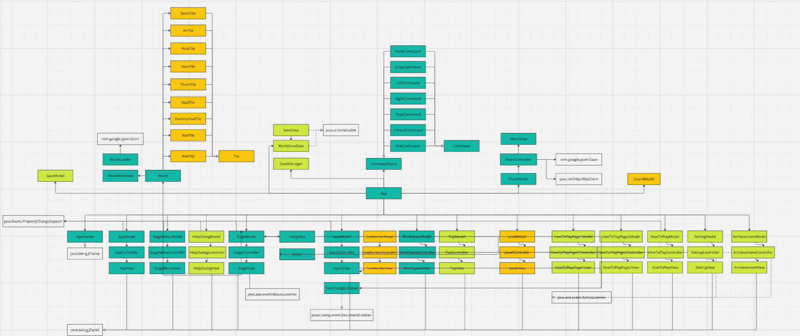
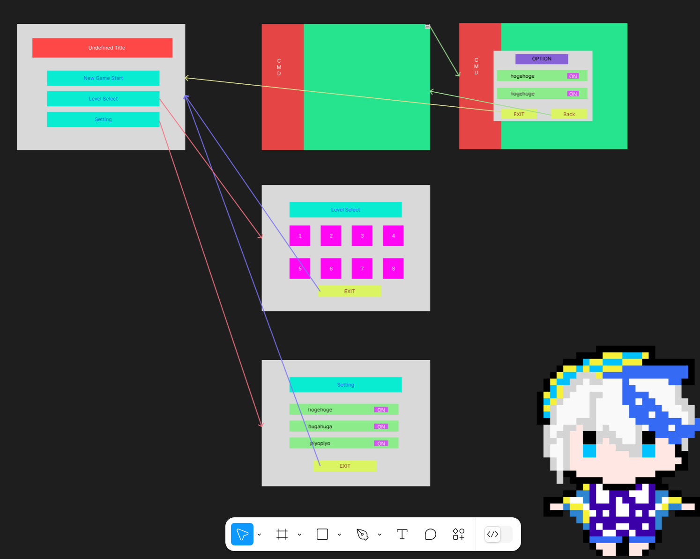
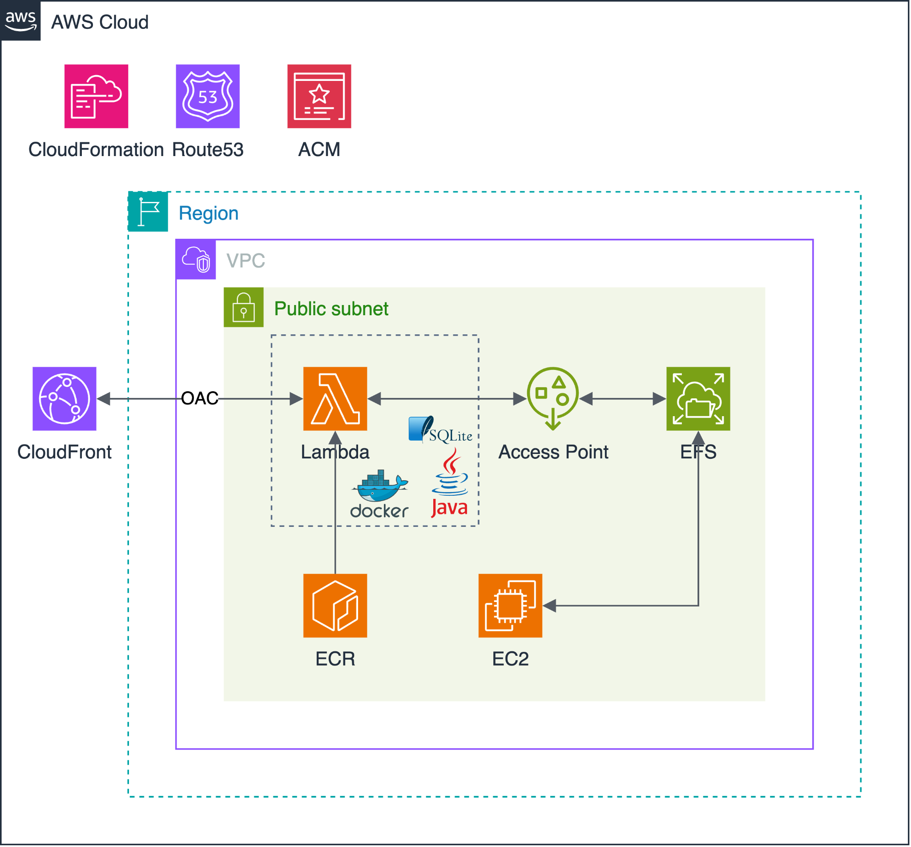
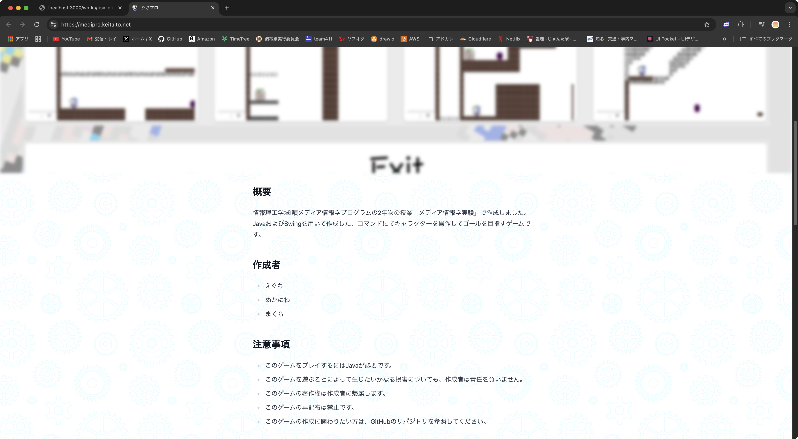

大学の講義「メディア情報学プログラミング演習」で作成したJava製のゲームです。
ゲーム内言語によるプログラミングを行い、プレイヤー「りさじゅう」をゴールまで導くゲームです。
ゲームのルールや操作方法は、ゲーム内のチュートリアルで説明されています。

公式サイトは以下のリンクからアクセスできます。

https://medipro.keitaito.net

## ゲームクライアント

### 使用技術

- Java (Swing)
- Figma

設計段階のクラス図はJiraにて作成しました。

Figmaを使用して、ゲームのUIデザインを行いました。

## ゲームサーバー

### 使用技術

- Java (Http Server)
- SQLite
- AWS (Lambda, EFS, ECR, CloudFront, Route53)

ゲームサーバーはAWS上に構築されており、ゲームからHTTPリクエストを受け付けて、状態を管理します。
ゲームの状態はEFS上のSQLiteファイルに保存されており、Lambda関数からアクセスします。
LambdaはJavaでHTTPサーバーを構築し、Lambda Web Adapter、Docker上で動作します。
GitHub Actionsを使用して、ECRにDockerイメージをプッシュし、Lambda関数をデプロイしています。

AWSはCDKを使用して構築しました。

## ウェブサイト（広報）

### 使用技術

- Next.js (SSG)
- Tailwind CSS
- Cloudflare Pages

ウェブサイトはNext.jsをSSGで使用している単純なものです。
Cloudflare Pagesを使用してデプロイしています。

開発は大学のメンバー3人で行い、GitHubを使用してコードを管理することを実践的に行いました。
技術力が違うメンバーでの開発で分担を行い、各自の得意な分野を活かして開発を行いました。
